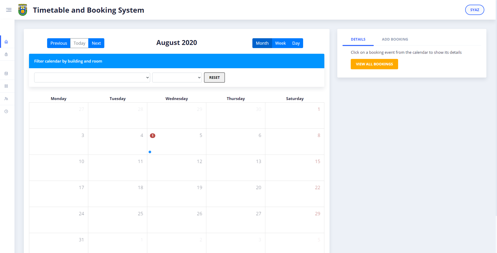

# ⚡ Timetabling and Room Booking System ⚡



## To run Angular + ASP.NET Core Web API project:

1. Download and install latest .NET Core SDK.
2. Download and install latest Node.js LTS version.
3. Once installed, open Node.js command prompt and run: 

```sh
npm install -g @angular/cli
```

4. In Node.js command prompt, go to the `DotNetAngularApp` directory and run:

```sh
dotnet watch run
```

5. It will take some time to download the `node_modules`. Go and make a coffee.
6. Once the server is loaded, open https://localhost:5001 in your browser.

## To create the database:

1. Stop the running application in the terminal by pressing `Ctrl+C`.
2. Install Entity Framework

```sh
dotnet tool install --global dotnet-ef
```

3. Update database

```sh
dotnet ef database update
```

